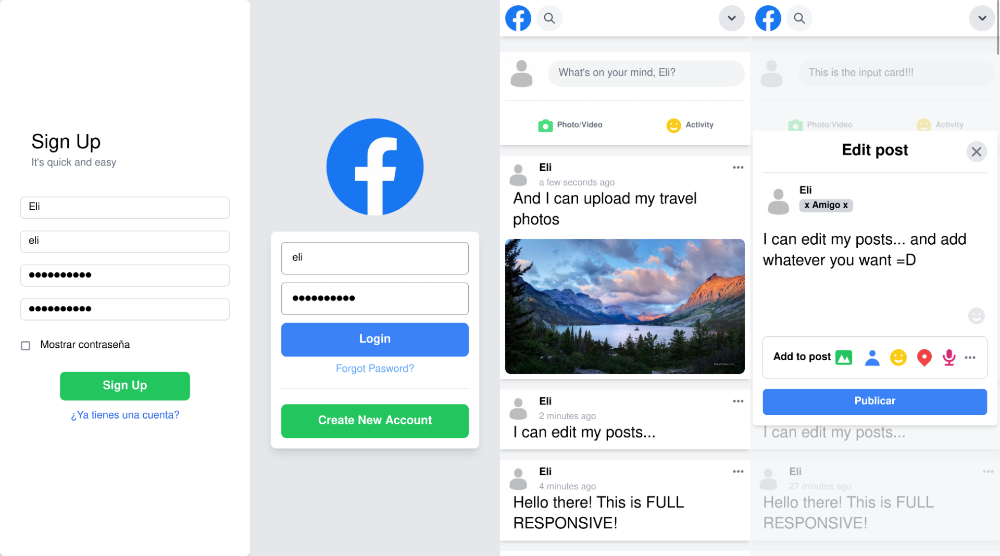
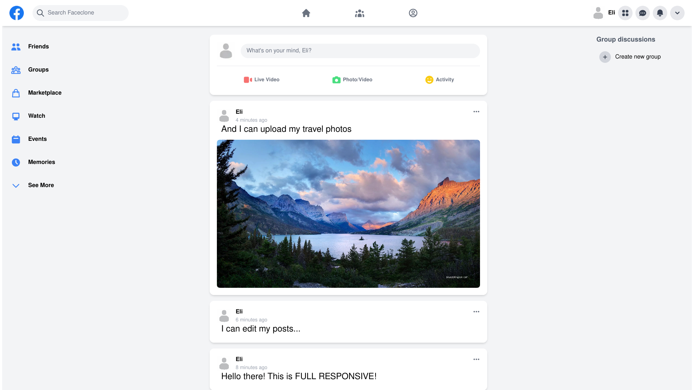
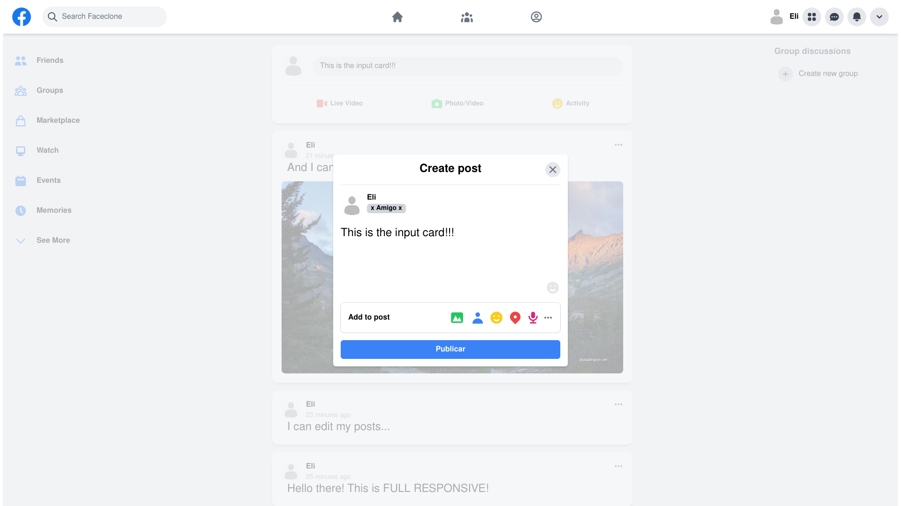

# Faceclone 

Faceclone is my very first project for learn Next.js, Tailwind CSS and Firebase. In spite of being my first big fullstack project, I wanted to add the maximum number of functionalities and features to the app. Also I've used a MySQL database to handle the users register and login locally.

## Features

- Mobile responsive
- Login and register users
- Publish, edit and delete posts
- Upload pictures to posts
    

## Screenshots

## Developing

- Individual user page
- Modify user profile
- Settings page
- Like the posts
- Add friends
